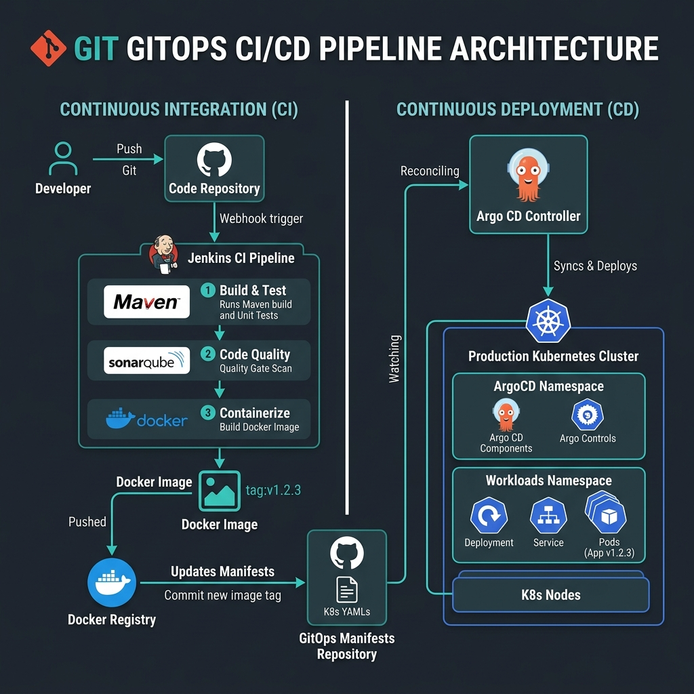

# Enterprise GitOps CI/CD Pipeline Showcase

[](https://kubernetes.io)
[](https://jenkins.io)
[](https://argoproj.github.io/cd/)
[](https://www.sonarqube.org/)
[](https://www.docker.com/)

A premium, production-ready DevOps portfolio project implementing an automated **GitOps continuous integration and continuous deployment (CI/CD) pipeline** for a Spring Boot microservice. 

This repository showcases enterprise-grade practices, including declarative pipeline configuration, automated static application security testing (SAST), artifact containerization, secure non-root runtime environments, and automated pull/push-based reconciliation deployments.

---

## 📁 GitOps Decoupled Repositories

Following GitOps best practices, this project is split into two independent repositories to separate build-time logic (CI) from runtime deployment configurations (CD):

1. **Application Source Repo (This Repository)**: Contains the Spring Boot application source code, unit tests, custom Dockerfile, and the declarative Jenkinsfile.
2. **GitOps Manifests Repo**: Contains the declarative Kubernetes manifests (Deployment, Service, Ingress) and the Argo CD Application configuration. 
   👉 **View the manifests repository here**: [omarwaziry/enterprise-gitops-manifests](https://github.com/omarwaziry/enterprise-gitops-manifests)

---

## 🏗️ Architectural Overview

This system divides the responsibilities between continuous integration (CI) and continuous deployment (CD) by utilizing two distinct Git repositories.



### Flow Walkthrough
1. **Developer Commits Code**: Code changes are pushed to the **Application Source Repository**.
2. **Jenkins CI Trigger**: A webhook notifies Jenkins, starting the declarative pipeline.
3. **Build & Quality Check**:
   - Jenkins builds the codebase using **Maven**.
   - Static analysis is performed via **SonarQube**, measuring code complexity, vulnerabilities, and coverage.
   - The pipeline blocks until SonarQube's **Quality Gate** callback verifies criteria are met.
   - Unit and integration tests are executed, generating JaCoCo reports.
4. **Containerize & Push**: A multi-stage **Dockerfile** builds a minimal container and uploads it to **Docker Hub**.
5. **GitOps Image Update**: Jenkins checks out the **GitOps Manifests Repository**, updates the image version tag in `deployment.yaml`, and commits/pushes the change back.
6. **Argo CD Deployment**: Argo CD detects the divergence in the manifests repository and synchronizes the state to **Kubernetes** to deploy the changes with zero downtime.

---

## 📸 Pipeline & Deployment Screenshots

Here is a visual walk-through of the live, working DevSecOps environment and pipeline stages:

### 1. GitOps Deployment Dashboard (Microservice Web UI)
The dynamic web application deployed inside the Kubernetes pod, reflecting the current live version and stage progression status.
<p align="center">
  
</p>

### 2. Jenkins CI Dashboard
The continuous integration manager showing the successful pipeline run (`#24`), JUnit test pass trend, and the integrated SonarQube Quality Gate status.
<p align="center">
  
</p>

### 3. SonarQube Code Security analysis (SAST)
Static application security testing verifying clean code metrics, 0 bugs, 0 vulnerabilities, and passing the customized quality gate.
<p align="center">
  
</p>

### 4. Argo CD GitOps Synchronization
Argo CD mapping changes from the manifests repository and reconciling the Kubernetes cluster state automatically.
<p align="center">
  
</p>

### 5. Docker Hub Container Registry
Docker Hub showing the automated container image tags built and pushed by the Jenkins CI runner.
<p align="center">
  
</p>

### 6. CentOS Dev Environment CLI
VM terminal status displaying the active minikube pods and the running local DevSecOps infrastructure.
<p align="center">
  
</p>

### 7. Automated Tag Update Execution
Jenkins console logs proving the successful container compilation, testing, registry pushing, and manifest auto-commit.
<p align="center">
  
</p>

---

## 🛠️ Repository Structures

### 1. Application Source Code (`app-source-repo/`)
* Contains the Java/Spring Boot source files.
* [pom.xml](file:///d:/Omar/Projects/New%20folder/app-source-repo/pom.xml): Core configurations and dependency inclusions.
* [Dockerfile](file:///d:/Omar/Projects/New%20folder/app-source-repo/Dockerfile): Multi-stage container file building from base compilation images.
* [Jenkinsfile](file:///d:/Omar/Projects/New%20folder/app-source-repo/Jenkinsfile): Complete pipeline definition with Docker pushes and automated GitOps manifest overrides.
* [sonar-project.properties](file:///d:/Omar/Projects/New%20folder/app-source-repo/sonar-project.properties): Project properties for SonarQube SAST analyses.

### 2. GitOps Manifests (`gitops-manifests-repo/`)
* [deployment.yaml](file:///d:/Omar/Projects/New%20folder/gitops-manifests-repo/deployment.yaml): Orchestration specs, resource queries, rolling update settings, and actuator probes.
* [service.yaml](file:///d:/Omar/Projects/New%20folder/gitops-manifests-repo/service.yaml): Internal ClusterIP routing setup.
* [ingress.yaml](file:///d:/Omar/Projects/New%20folder/gitops-manifests-repo/ingress.yaml): External gateway route setup using Host Headers (`devops-showcase.local`).
* [argocd-app.yaml](file:///d:/Omar/Projects/New%20folder/gitops-manifests-repo/argocd-app.yaml): Declarative Argo CD application mapping git manifests to Kubernetes.

---

## 🚀 Step-by-Step Setup Guide

Follow this guide to spin up this infrastructure locally or on a cloud virtual machine.


### Part 1: Prerequisites
Ensure you have access to:
* A Kubernetes Cluster (e.g. Minikube, Kind, EKS)
* Jenkins Server
* SonarQube Server
* Docker Hub Account
* GitHub Account

---

### Part 2: Configuring Jenkins CI
1. **Install Plugins**:
   * Navigate to *Manage Jenkins* -> *Plugins* and install:
     * `SonarQube Scanner`
     * `Pipeline Utility Steps`
     * `Slack Notification`
     * `Docker Pipeline`
2. **Add Credentials**:
   * Navigate to *Manage Jenkins* -> *Credentials*:
     * Create **Username/Password** credential called `docker-hub-credentials` (Docker Hub account credentials).
     * Create **Username/Password** credential called `github-token` (GitHub username and a Personal Access Token with write access to the manifests repository).
3. **Configure Tools**:
   * Navigate to *Manage Jenkins* -> *Tools*:
     * Set up a JDK installation named `JDK17` pointing to Java 17.
     * Set up a Maven installation named `Maven3` pointing to Maven 3.x.
4. **Configure SonarQube Connection**:
   * Navigate to *Manage Jenkins* -> *System*:
     * Add a **SonarQube Server** named `SonarQubeServer` with the SonarQube URL and authentication token.

---

### Part 3: Configuring SonarQube Quality Gates
1. Log in to SonarQube and create a new project with the key `com.example:devops-showcase-app`.
2. Generate an authentication token for the Jenkins scanner integration.
3. Configure a **Webhook** in SonarQube pointing to:
   ```
   http://<your-jenkins-url>/sonarqube-webhook/
   ```
   *This enables SonarQube to callback to Jenkins to release the `waitForQualityGate()` step in the pipeline.*

---

### Part 4: Deploying with Argo CD (GitOps)
1. Install Argo CD on your Kubernetes cluster:
   ```bash
   kubectl create namespace argocd
   kubectl apply -n argocd -f https://raw.githubusercontent.com/argoproj/argo-cd/stable/manifests/install.yaml
   ```
2. Expose and log in to the Argo CD dashboard:
   ```bash
   kubectl port-forward svc/argocd-server -n argocd 8080:443
   ```
3. Apply the Argo CD Application manifest to synchronize your manifests repository:
   ```bash
   kubectl apply -f gitops-manifests-repo/argocd-app.yaml
   ```
   *Argo CD will automatically deploy the Deployment, Service, and Ingress to the target namespace `production` and start tracking for updates.*

---

## 💎 Portfolio Highlights

This project showcases several advanced DevOps practices:

* **Security-First Container Architecture**:
  * The `Dockerfile` uses a **multi-stage build** which leaves the source code and compile tools behind, producing a container only containing the JRE runtime.
  * The container runs as a **non-privileged non-root user** (`appuser`), minimizing vulnerability attack surfaces.
* **Resilient Kubernetes Configurations**:
  * **Rolling Updates** are tuned with `maxSurge: 1` and `maxUnavailable: 0` to guarantee zero-downtime upgrades.
  * Liveness and readiness configurations hook into **Spring Boot Actuator** to provide immediate failure detection and self-healing.
* **Separation of Concerns (CI vs CD)**:
  * Application repositories do not contain environment configuration files. Infrastructure changes are committed via automation to the `gitops-manifests-repo`.
  * The CD controller (Argo CD) operates pull-based deployments, reducing security privileges required on the Jenkins server (Jenkins needs zero access to the Kubernetes cluster API).
* **Automated Rollback & Self-Healing**:
  * Argo CD configuration includes `prune: true` and `selfHeal: true`. Any manual changes made to the cluster will be instantly overwritten with the source-of-truth defined in Git.

---

## 🎁 Bonus: Local Dev VM Lab Setup (Low-Memory Optimized)

For developers looking to run this entire DevSecOps environment locally on a resource-constrained VM (e.g., **8GB RAM, 2 CPUs** running Ubuntu, Debian, CentOS, RHEL, or Fedora), we provide automation resources under the [local-env](./local-env) directory:

* **[docker-compose.yml](./local-env/docker-compose.yml)**: Runs Jenkins and SonarQube on the host Docker engine with customized JVM heap constraints (`-Xmx512m` limits) to prevent system OOM errors.
* **[setup-devsecops-env.sh](./local-env/setup-devsecops-env.sh)**: A cross-distro automation script that:
  1. Configures host elasticsearch kernel maps (`vm.max_map_count=524288`).
  2. Dynamically opens network ports `8080`, `9000`, `80`, and `443` depending on the active firewall detected (UFW or firewalld).
  3. Launches Minikube container cluster with a strict limit of `2.5GB` RAM.
  4. Deploys the Argo CD controller in the cluster.

To configure and run the local lab setup:
```bash
cd local-env
chmod +x setup-devsecops-env.sh
sudo ./setup-devsecops-env.sh
```
