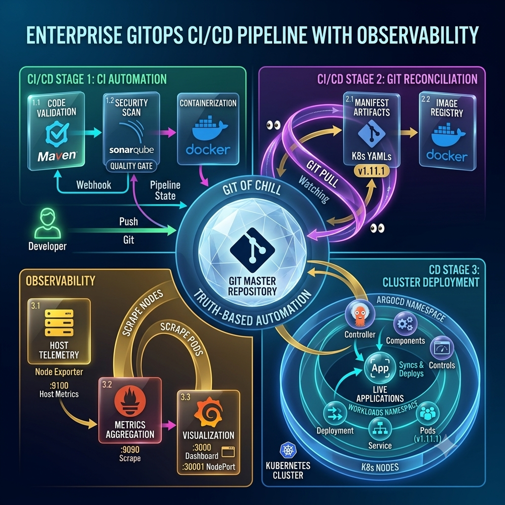
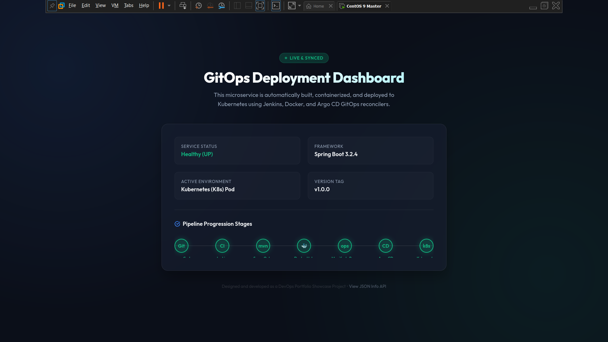
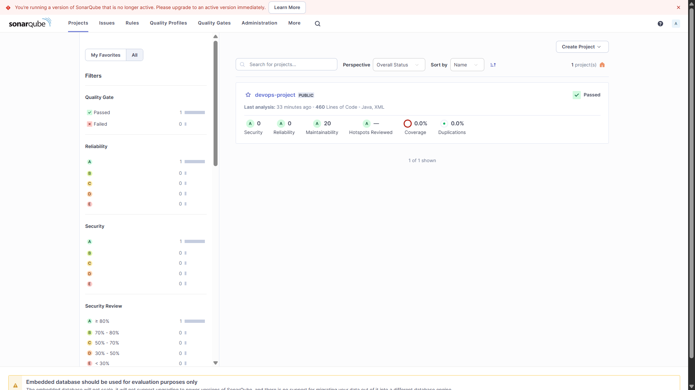
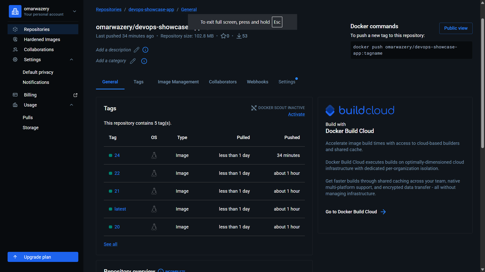

# Enterprise GitOps CI/CD Pipeline

[](https://openjdk.org/projects/jdk/17/)
[](https://spring.io/projects/spring-boot)
[](https://www.jenkins.io/)
[](https://www.sonarqube.org/)
[](https://www.docker.com/)
[](https://kubernetes.io/)
[](https://argoproj.github.io/cd/)

This repository is the **CI half** of a two-repo GitOps pipeline. It contains the Spring Boot application source, a hardened multi-stage Dockerfile, and a declarative Jenkinsfile that drives every stage from commit to container registry to GitOps manifest update.

The **CD half** (Kubernetes manifests, Argo CD config, monitoring stack) lives here:
**[enterprise-gitops-manifests](https://github.com/your-username/your-gitops-manifests-repo)**

---

## If You Are Cloning This Project

Five things to change before anything will work. Everything else is ready to go.

| # | File | What to change |
|---|---|---|
| 1 | `Jenkinsfile` | `DOCKER_REPO` — your Docker Hub username and repo name |
| 2 | `Jenkinsfile` | `MANIFESTS_GIT_REPO` — your GitOps manifests repository |
| 3 | `Jenkinsfile` | `DEPLOYMENT_YAML_PATH` — path to deployment.yaml inside the manifests repo |
| 4 | `sonar-project.properties` | `sonar.projectKey` and `sonar.projectName` |
| 5 | Jenkins UI | Create the two credentials described in the Setup Guide below |

---

## Table of Contents

1. [Architecture](#architecture)
2. [Pipeline Stages](#pipeline-stages)
3. [Repository Structure](#repository-structure)
4. [Setup Guide](#setup-guide)
5. [Live Environment Screenshots](#live-environment-screenshots)
6. [Local Dev Lab Setup](#local-dev-lab-setup)

---

## Architecture

<p align="center">
  
</p>

Jenkins never touches the Kubernetes cluster. It only writes to a Git repository. Argo CD, running inside the cluster, pulls from that repo on its own schedule. A compromised Jenkins server cannot directly deploy to Kubernetes.

---

## Pipeline Stages

### Stage 1 — Initialize & Clean
Wipes the workspace and checks out source code fresh on every run. Prevents any leftover files from a previous build affecting results.

### Stage 2 — Build & Test
Runs `mvn clean verify`. This single command compiles the source, executes the full test suite, and generates the JaCoCo XML coverage report — all in the correct order. The JUnit and coverage results are published to the Jenkins build page.

Tests run here, before SonarQube, so the coverage file exists when the scanner reads it in the next stage. Running `mvn verify` instead of `mvn package` is what triggers the JaCoCo report goal bound to the verify lifecycle phase.

### Stage 3 — SonarQube Analysis
Runs `mvn sonar:sonar` against the configured SonarQube server. The scanner reads the `jacoco.xml` produced in Stage 2 so coverage figures are accurate. Analysis covers security vulnerabilities, reliability bugs, code smells, and coverage thresholds.

### Stage 4 — Quality Gate
Blocks the pipeline via `waitForQualityGate()` until SonarQube sends its webhook callback. If the gate fails, the pipeline aborts — no image is built, nothing reaches Docker Hub, Kubernetes sees no change. Security is a hard gate, not an advisory.

### Stage 5 — Docker Build & Push
Builds the image using the multi-stage Dockerfile and pushes two tags:
- `:<BUILD_NUMBER>` — immutable, used for GitOps rollback
- `:latest` — floating convenience tag

### Stage 6 — GitOps Manifest Update
Clones the manifests repo using a temporary Git credentials file (the token is never interpolated into a shell string), runs `sed` to update the image tag in `deployment.yaml`, and pushes a commit with `[skip ci]` in the message. Argo CD detects the commit and begins a rolling deployment.

---

## Repository Structure

```
app-source-repo/
│
├── src/
│   ├── main/java/com/example/devopsproject/
│   │   ├── DevopsProjectApplication.java
│   │   └── controller/HomeController.java
│   └── test/java/.../DevopsProjectApplicationTests.java
│
├── Dockerfile                     # Two-stage build: JDK builder → JRE runtime
├── Jenkinsfile                    # Six-stage declarative pipeline
├── pom.xml                        # Maven build, JaCoCo, Micrometer Prometheus
├── application.properties         # Actuator endpoint exposure config
├── sonar-project.properties       # SonarQube project config
│
├── local-env/
│   ├── docker-compose.yml         # Jenkins + SonarQube with JVM heap caps
│   ├── jenkins.Dockerfile         # Jenkins image with Docker CLI pre-installed
│   └── setup-devsecops-env.sh     # One-shot VM bootstrap script
│
└── images/                        # Live environment screenshots
```

### Dockerfile Design

```
Stage 1 (builder): maven:3.9.6-eclipse-temurin-17-alpine
  └── pom.xml copied first → dependency layer cached independently
  └── mvn package produces the fat JAR

Stage 2 (runtime): eclipse-temurin:17-jre-alpine
  └── JRE only — no JDK, no Maven, no source code
  └── curl installed for the HEALTHCHECK
  └── Non-root user (appuser, UID 1000)
  └── HEALTHCHECK polls /actuator/health every 30 seconds
```

The final image is ~200 MB. A JDK-based single-stage build would be ~500 MB and would include the compiler and source code in the production artifact.

---

## Setup Guide

### Prerequisites

- Kubernetes cluster (Minikube, Kind, or a cloud provider)
- Jenkins server with Docker socket access
- SonarQube server (Community Edition is sufficient)
- Docker Hub account
- GitHub account + Personal Access Token with `repo` write scope

---

### Step 1 — Fork / Clone and configure

1. Fork or clone this repository.
2. Open `Jenkinsfile` and update the three variables at the top:
   ```groovy
   DOCKER_REPO          = 'your-dockerhub-username/your-app-repo'
   MANIFESTS_GIT_REPO   = 'github.com/your-username/your-gitops-manifests-repo.git'
   DEPLOYMENT_YAML_PATH = 'k8s/deployment.yaml'
   ```
3. Open `sonar-project.properties` and update:
   ```properties
   sonar.projectKey=your-group-id:your-app-name
   sonar.projectName=Your App Name
   ```

---

### Step 2 — Jenkins plugins

Install these from **Manage Jenkins → Plugins**:

| Plugin | Why it is needed |
|---|---|
| `SonarQube Scanner` | Runs the SonarQube analysis and enables `waitForQualityGate()` |
| `Docker Pipeline` | Provides the `docker.build()` and `docker.withRegistry()` DSL |
| `JaCoCo` | Publishes code coverage reports on the build page |
| `AnsiColor` | Renders coloured console output |
| `Pipeline Utility Steps` | File utilities used inside pipeline scripts |

---

### Step 3 — Jenkins credentials

Go to **Manage Jenkins → Credentials → System → Global** and create:

| ID | Type | Value |
|---|---|---|
| `docker-hub-credentials` | Username/Password | Your Docker Hub username and password or access token |
| `github-token` | Username/Password | Your GitHub username and a Personal Access Token with repo write scope |

The credential IDs must match exactly. They are referenced by name in the Jenkinsfile.

---

### Step 4 — Jenkins tools

Go to **Manage Jenkins → Tools** and configure:

- **JDK** — Name: `JDK17`, install automatically from Adoptium, version `jdk-17.*`
- **Maven** — Name: `Maven3`, install automatically, version `3.9.*`

---

### Step 5 — SonarQube integration

1. In SonarQube, generate an analysis token: **User → My Account → Security → Generate Token**
2. In Jenkins: **Manage Jenkins → System → SonarQube servers**
   - Name: `SonarQubeServer`
   - URL: `http://<your-sonarqube-host>:9000`
   - Server authentication token: the token from step 1
3. In SonarQube: **Administration → Webhooks → Create**
   - URL: `http://<your-jenkins-host>:8080/sonarqube-webhook/`

The webhook is what releases the `waitForQualityGate()` block in Stage 4. Without it the pipeline will hang until the 10-minute timeout.

---

### Step 6 — Create the Jenkins pipeline job

1. **New Item → Pipeline**
2. Under **Pipeline**, select **Pipeline script from SCM**
3. SCM: Git, Repository URL: your fork of this repo
4. Script Path: `Jenkinsfile`
5. Under **Build Triggers**, enable **GitHub hook trigger for GITScm polling** and configure a webhook in your GitHub repo settings pointing to `http://<jenkins-host>:8080/github-webhook/`

---

## Live Environment Screenshots

### Deployed Application — GitOps Deployment Dashboard

The Spring Boot application running live inside a Kubernetes pod, accessed through the NGINX Ingress. The dashboard resolves the active service status, framework version, environment, and version tag at runtime from the running container.

<p align="center">
  
</p>

---

### Jenkins — Pipeline Status and Quality Gate

Build `#24` is the successful run. The SonarQube Quality Gate widget confirms the gate passed with `server-side processing: Success`. The Test Result Trend chart shows 3 passing tests across every successful run from `#16` through `#24`. Earlier builds (`#15`–`#23`) show the iteration required to tune the pipeline.

<p align="center">
  
</p>

---

### Jenkins — GitOps Manifest Auto-Commit

The console output from build `#24` proves the GitOps loop is closed. Jenkins committed the image tag bump to the manifests repo and pushed it. The line `Manifests repository updated successfully` followed by `Finished: SUCCESS` confirms the full pipeline ran end-to-end without human intervention.

<p align="center">
  
</p>

---

### SonarQube — SAST Results

SonarQube scanned 460 lines of Java and XML and returned 0 security issues, 0 reliability bugs, and a passing Quality Gate. The pipeline was blocked at Stage 4 until this result arrived via webhook. Any failure here would have aborted the build before an image was ever produced.

<p align="center">
  
</p>

---

### Docker Hub — Automated Image Registry

Every successful build pushes a new immutable tag to Docker Hub. Tags `20`, `21`, `22`, `24`, and `latest` each map to a Jenkins build number. The registry is the artifact store that bridges CI (Jenkins pushes) and CD (Argo CD pulls the tag written into `deployment.yaml`).

<p align="center">
  
</p>

---

## Local Dev Lab Setup

For running the full stack on a resource-constrained VM (8 GB RAM, 2 vCPUs). Tested on CentOS 9, Ubuntu, Debian, RHEL, Fedora.

```
local-env/
├── docker-compose.yml          # Jenkins + SonarQube, JVM heap capped at 512m
├── jenkins.Dockerfile          # Jenkins with Docker CLI pre-installed
├── prometheus.yaml             # Prometheus scrape config for the host VM
└── setup-devsecops-env.sh      # Handles firewall, Minikube, Argo CD install
```

```bash
cd local-env
chmod +x setup-devsecops-env.sh
sudo ./setup-devsecops-env.sh
docker-compose up -d
```

The script sets `vm.max_map_count=524288` (required for SonarQube's Elasticsearch), opens ports `8080`, `9000`, `80`, and `443`, starts Minikube limited to 2.5 GB RAM, and deploys Argo CD into the cluster.
